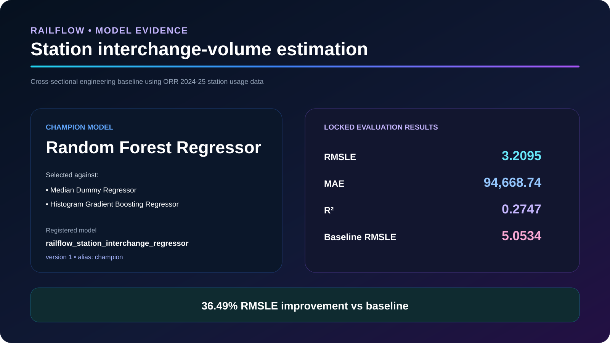
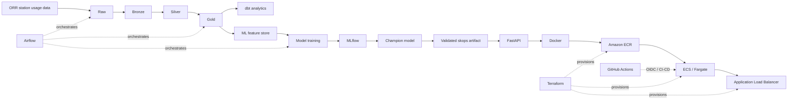

# RailFlow ML Data Platform

[](https://github.com/tosinmulero/railflow-ml-data-platform/actions/workflows/railflow-ci-cd.yml)
[](https://github.com/tosinmulero/railflow-ml-data-platform/actions/workflows/terraform-validate.yml)

**RailFlow** is an end-to-end UK rail data and machine-learning platform covering ingestion, medallion processing, analytics engineering, orchestration, ML governance, API serving, CI/CD, Infrastructure as Code and AWS deployment.

The project is designed as a production-style portfolio system, with emphasis on reproducibility, data quality, model governance, secure deployment and operational controls rather than model accuracy alone.

## Recruiter visual pack

<p align="center">
  
</p>

| Verified Delivery Evidence | Model Evidence |
| --- | --- |
|  |  |

## Architecture



## Key Engineering Results

- **2,595** source/Bronze records processed
- **2** exact duplicates detected
- **2,593** validated Silver/Gold station records
- **0** null station keys after cleaning
- **7** dbt models
- **22** explicit dbt tests
- **29 PASS / 0 ERROR** in the dbt build
- **38 pytest tests passed**
- Ruff checks passed
- Airflow data and ML lifecycle DAGs validated
- Dockerised FastAPI serving stack validated
- **25 Terraform-managed AWS resources** provisioned
- GitHub Actions authenticated to AWS through **OIDC**
- ECS/Fargate deployment completed successfully
- Live `/health`, `/model` and `/predict` checks passed

## Data Engineering

RailFlow uses Office of Rail and Road station usage data for the **2024-25 reporting period**.

```text
Raw -> Bronze -> Silver -> Gold -> dbt analytics / ML feature store
```

The Silver layer performs deduplication, schema normalisation and key validation. The Gold layer publishes analytics-ready station marts and a deterministic ML feature dataset.

## Analytics Engineering

dbt provides modular SQL modelling, testing, documentation and lineage.

```text
7 models
22 explicit tests
29 PASS
0 ERROR
```

## Orchestration

Apache Airflow coordinates the end-to-end data pipeline:

```text
preflight
  -> ingest_raw
  -> raw_to_bronze
  -> bronze_to_silver
  -> silver_to_gold
  -> dbt_build
  -> dbt_docs
  -> validate_quality
```

The ML lifecycle DAG controls retraining and deployment readiness:

```text
feature_store_ready
  -> retrain_if_dataset_changed
  -> validate_registry_champion
  -> build_serving_artifact
  -> validate_serving_artifact
  -> deployment_ready
```

## Machine Learning

The ML use case is **station interchange-volume estimation**.

This is intentionally framed as a **cross-sectional estimation problem rather than future forecasting**, because the current dataset contains one annual reporting release rather than a longitudinal time series.

Candidate models:

- Median Dummy Regressor
- Random Forest Regressor
- Histogram Gradient Boosting Regressor

### Champion Model

**Random Forest Regressor**

| Metric | Result |
|---|---:|
| RMSLE | **3.2095** |
| MAE | **94,668.74** |
| R² | **0.2747** |
| Baseline RMSLE | **5.0534** |
| RMSLE improvement | **36.49%** |

Registered model: `railflow_station_interchange_regressor`
Version: `1`
Alias: `champion`

## MLOps and Model Governance

MLflow handles experiment tracking, candidate comparison, metrics, registry metadata and champion management.

The serving path uses a validated **skops** artifact. Before serving, RailFlow verifies validation approval, dataset fingerprint, feature contract, artifact SHA-256, trusted serialisation types, champion registry metadata and prediction equivalence.

## FastAPI

The deployed API exposes:

```text
GET  /health
GET  /model
POST /predict
```

Inputs are validated using Pydantic. The deployed AWS service successfully passed all three endpoint checks.

## Testing and Quality

```text
38 pytest tests passed
Ruff checks passed
```

## CI/CD

GitHub Actions provides workflows for Python quality/testing, Docker API smoke testing, champion image publishing, Terraform validation and AWS ECS deployment.

AWS authentication uses **GitHub OIDC**, avoiding long-lived AWS deployment credentials inside GitHub.

```text
GitHub Actions
      |
      v
GitHub OIDC
      |
      v
AWS IAM deployment role
      |
      v
Docker build -> Amazon ECR -> ECS/Fargate -> Application Load Balancer
```

## AWS Infrastructure

Terraform provisions the development environment in `eu-west-2`.

Infrastructure includes VPC networking, two public subnets, Internet Gateway, routing, security groups, Application Load Balancer, target group, Amazon ECR, ECS cluster, ECS task definition, Fargate service, CloudWatch log group, IAM roles and a GitHub OIDC provider.

Initial Terraform deployment:

```text
Plan: 25 to add, 0 to change, 0 to destroy.
```

## AWS Deployment Verification

```text
ECS service : ACTIVE
Desired     : 1
Running     : 1
Pending     : 0
```

API verification:

```text
/health   PASS
/model    PASS
/predict  PASS
```

The AWS environment is treated as an **ephemeral portfolio deployment**, allowing the infrastructure to be destroyed after validation to control recurring cloud cost.

## Security Controls

- GitHub-to-AWS authentication via OIDC
- main-branch-restricted trust policy
- immutable GitHub repository identity
- dedicated deployment IAM role
- ECS ingress restricted to ALB
- non-root Docker runtime
- immutable SHA-tagged ECR images
- ECR image scanning
- ECS deployment circuit breaker
- validated model serialisation
- strict API input validation

## Technology Stack

**Data Engineering:** Python · PySpark · SQL · Parquet · dbt · DuckDB
**Orchestration:** Apache Airflow
**Machine Learning:** scikit-learn · MLflow · pandas · NumPy · skops
**API:** FastAPI · Pydantic · Uvicorn
**DevOps:** Docker · Docker Compose · GitHub Actions
**Cloud:** AWS · ECS · Fargate · ECR · ALB · IAM · CloudWatch · VPC
**Infrastructure as Code:** Terraform
**Quality:** pytest · Ruff · dbt tests · quality gates

## Model Limitations

The current champion is an engineering baseline, not a production rail-demand forecasting system.

A stronger future model would incorporate multiple years of station usage, timetable and service-frequency data, station geography, network topology, operator information, disruption data and temporal validation.

## Outcome

RailFlow demonstrates the complete lifecycle:

**data ingestion -> transformation -> analytics engineering -> orchestration -> ML experimentation -> governance -> API serving -> containerisation -> CI/CD -> Infrastructure as Code -> cloud deployment**

## Author

**Oluwatosin Oluwaseun Mulero**

Data Analyst | Data Scientist | Data & ML Engineering Portfolio
